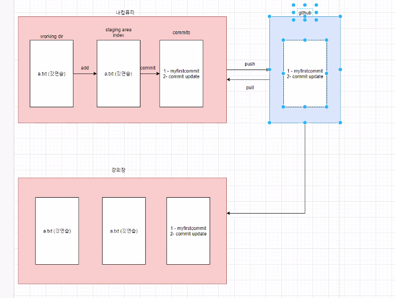
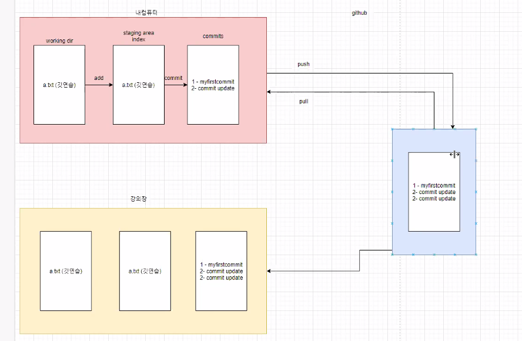

# 다른 공간에서 깃허브 자료 가져오기

1.  깃허브에서 해당 코드 다운로드 받기  (clone)
2.  ls
3.  git clone 해당주소
4.  cd TIL
5.  git log
6.  git log --oneline  //확인하는 명령어
7.  파일을 수정
8.  git add .
9.  git commit -m "update README"
10.  (집컴)이제 집컴퓨터로 돌아와서:  git pull origin master  
11.  
12.  --------------------------------------------------------------------------------------------------------------
13.  이제 충돌이 나는 상황 (강의장, 집에서 파일 수정됨)
14.  git diff
15.  (집) q 로 빠져나옴  git add .     / (강의장) git add .
16.  (집)  git commit -m "home"    / (강의장)  git commit -m "multi"
17.  (집)  git log --online      / (강의장)   git log --online
18.   (집)  git push origin master   / (강의장)   git push origin master
19.   (집)    업로드됨   / (강의장)   실패함
20.    (집)       / (강의장)  git status
21.   (집)       / (강의장)   git add .
22.   (집)       / (강의장)   git commit -m "merging"
23.   (집)       / (강의장)   git log --oneline
24.   (집) git pull origin master      / (강의장)   git push origin mastet
25.   (집)       / (강의장)   
26.   (집)       / (강의장)   
27.   (집)       / (강의장)   
28.   (집)       / (강의장)   
29.   (집)       / (강의장)   
30.   (집)       / (강의장)   
31.   (집)       / (강의장)   
32.   (집)       / (강의장)   
33.   (집)       / (강의장)   
34.   
35.  
36.  
37.  
38. 