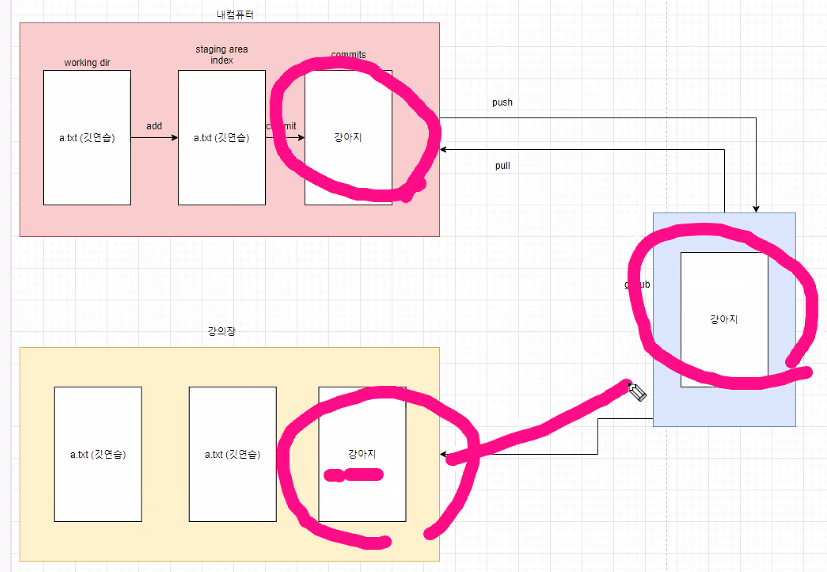
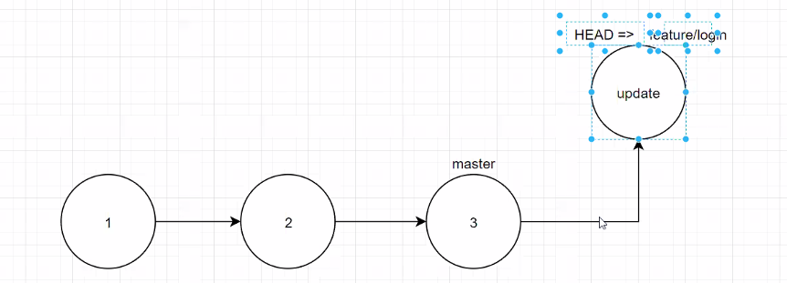
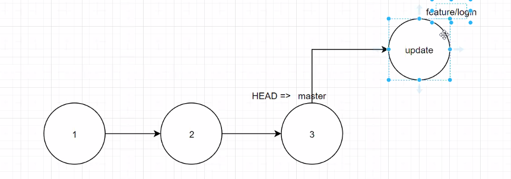
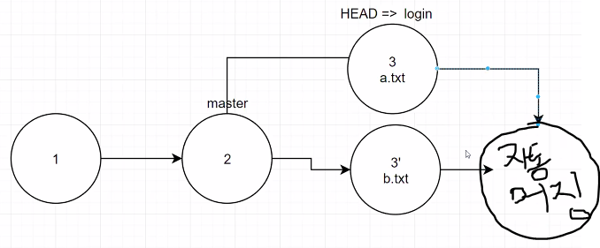
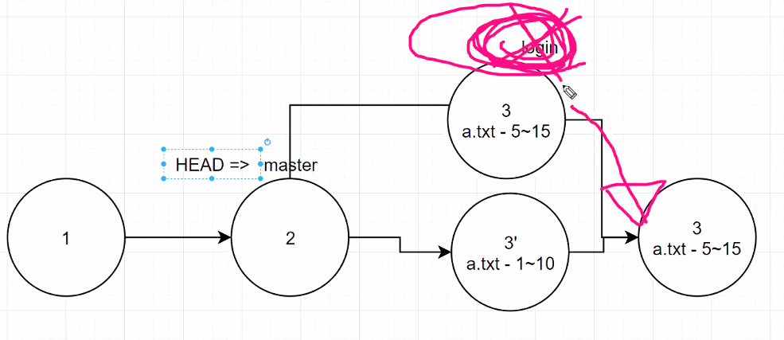

깃허브 코드 협업 실전.

  

LEEJINHEEHUB

A의 코드

1. touch README.md  //생성 
2.  git init
3.  git commit -m "update"   //커밋
4.  git remote add origin https://github.com/LEEJINHEEHUB/end-to-end.git
5.  git push origin master  //푸시

pull 받을 때햣

1. git pull origin master

다시 푸시할때 

1. git add .
2. git commit -m "change2"
3. git push origin master

B의 코드 

1. 자기(B) 레포지토리 clone 주소 복사
2.  바탕화면에서 깃배쉬
3.  git clone https://github.com/LEEJINHEEHUB/end-to-end.git(B의 주소)
4.  현상황

----------------------------------------------------------------------------------------------------------------

B와 A가 같이 수정하는 과정에서 B가 먼저 수정했을때 

1. (B)  코드 수정후 올림 / (A) 코드 수정후 올림 (에러발생)
2. (B)   /  (A)일단 git pull origin master 로 B의 코드를 풀 받음
3. (B)  / (A) 그리고 그 파일을 열어보면` <<<<<<<<<<head` 이런식의 수정된게 보임
4. (B)  / (A) 수정된 것들을 모두 지우고 통일된 코드로 작성 후 저장
5. (B)  / (A) 다시 깃에 올림 
6. (B)  / (A)  git add .
7. (B)  / (A)  git commit -m "change1"
8. (B) 다시 푸시된  코드 확인 / (A)  git push origin master
9. (B)  / (A)
10. (B)  / (A)
11. (B)  / (A)
12. (B)  / (A)
13. (B)  / (A)
14. (B)  / (A)
15. (B)  / (A)
16. 

--------------------------------------------------------------------------------------------------

# git branch

branch :  commit들의 목록이 뭉쳐져 있는 

1.  git branch
2.  git branch [change]    // []-브랜치 이름
3.  브랜치를 이동할거임
4.  git checkout change   //   브랜치가 change로 바꼈을거임. * 2.23버전 이상은 git switch change 
5.  git branch -d change          //브랜치 삭제 *활동하고 있는 브랜치는 삭제불가 
6.  git checkout master     // 마스터로 변경
7.   git branch -d change   // 삭제

### 브랜치별 기능 생성 (Fast-Forward 전략)

1. git branch feature/login 

2. git checkout feature/login    // 피쳐 로그인으로 이동

3. git log --oneline    // `(HEAD ->` 의미는 `최근` 을 의미

4. 

5. touch b.tx  // 예시로 새로운 파일을 추가함

6. git add .

7. git commit -m "update"

8. git log --oneline  //확인해보면

9. 

10.  이제 다시 병합해 볼거임!!  (메인이 되는 브렌치로 이동후 흡수를 시킬거임)

11.    git checkout master // 이제 다끝났다고 가정하고 마스터로 스위치시킴.

12. 밑에선 헤드가 다시 master로 돌아왔고, feature/login은 사라짐, 하지만 브랜치 상에는 존재함.

13. 

14.  git merge feature/login   / 머지시킴

​    

15.  git branch -d feature/login / 브랜치 삭제할땐

16.  git branch /삭제 됐는지 확인

 

# 새로운 브랜치 만들어보기

#### 자동머징 case
1.  git branch signup
2.  git checkout signup   // 해당 브랜치로 가서
3.   touch signup.txt  //파일 만들고
4.  git add .     //add
5.  git commit -m "update"    //commit
6.  git checkout master    // 다시 마스터로 돌아가자.
7. touch login.txt    //파일 만들고 
8.  git add .      //add
9.  git commit -m "update login"   //commit 
10.  git log --oneline //확인해보기
11.  git checkout master  //마스터로 이동
12.  git log --oneline   //다시 확인
13.  이제부터 이 둘을 병합할거임ㅇㅇ
14.  git merge signup     // 합쳐줘 (자동으로 머지가 될거임.)
15.  git log --oneline   //  [ (HEAD -> master) Merge branch 'signup'] 이렇게 뜰거임
16.  git log --oneline --graph    // 우리가 브렌치를 만들었을때 이 가지가 어떻게 빠져나왔고 어떻게 병합되었는지 cli 환경에서 직관적으로 보여줌 
17.  git branch -d signup   //마지막으로 이제 signup 브랜치를 지워줘야함
18. git log --oneline --graph // 잘 지워졌는지 확인
19.  git push origin master //이제 푸쉬 해주고 깃에서 확인 `해당 리포지토리에서 lnsights -> network 에서 확인

##  이번엔 컴플릭트가 나도록 브랜치 만들어보기

1. git branch logout  //생성
2.  git checkout logout  //이동
3.  touch logout.txt  //실제로는 여기서 코드를 작성해야함
4.  git diff
5.  git add .
6.  git commit -m "team"
7.   git checkout master
11.  

##### 예시  

1. git branch readme

2. git checkout readme

3. git add .

4. git commit -m "update"

5. git checkout master

6. git add .

7. git commit -m "update"

8. git merge readme

   --------------------------------------------------------------------------------------------

   ### 실제 브랜치 협업 해보기 (github에서 merge 해볼거임)

1.  git branch jin
2.   git checkout jin  
3. 파일 수정후
4.  git add .
5.  git commit -m "섭지코지"
6. git push origin jin
7.  이제 병합할거임
8.  깃허브 해당 리포지토리 pull requets 에서 수정하고 머지하고 의견 나누기

* git checkout master  //다시 마스터로 돌아와
*  git log --oneline --graph  // 최신화가 안되어있을거임
* git pull origin master // 받아와
* git log --oneline --graph  //최신화 완료
*  git branch  //branch 확인 
* git branch -d jin // 썼던 브랜치 삭제
* 

# Fork 기능 사용하기 

1.  상대 리포지토리에 해당 코딩 우측 위 포크
2.  내 계정으로 가져오기
3.  가져온 코딩 클론 복사
4.  바탕화면에 깃 배쉬 후 git clone https://github.com/LEEJINHEEHUB/backiljang.git (내 클론 주소)
5.   바탕화면에 생긴 백일장 파일에 README.md 작성
6.  
7.  
8.  
9.  
10.  
11.  
12.  
13.  
14.  
15.  
16. 

